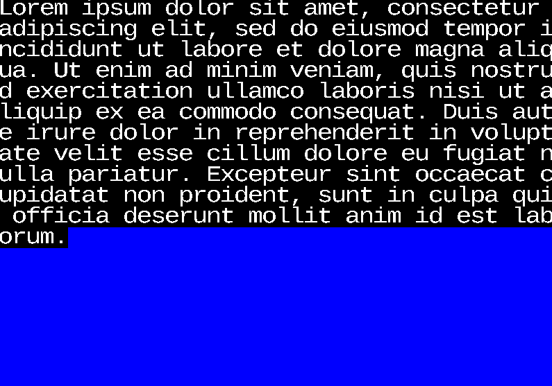

# Gputype: TrueType Font rendering demo
I got aggravated by [SLUG](https://sluglibrary.com/) being closed source so I tried to make my own little ttf shader with [Vulkano](https://github.com/vulkano-rs/vulkano). The result is obviously very basic but it does work. 

## Libraries you should use instead  of taking from this
- [libschrift](https://github.com/tomolt/libschrift) 
- [stb_truetype](https://github.com/nothings/stb/blob/master/stb_truetype.h)
### TODO:
- Grid fitting for instructed fonts
- Actual text layout
- A way to use it as a library rather than a really bad way to view text.
- Supersampling maybe?